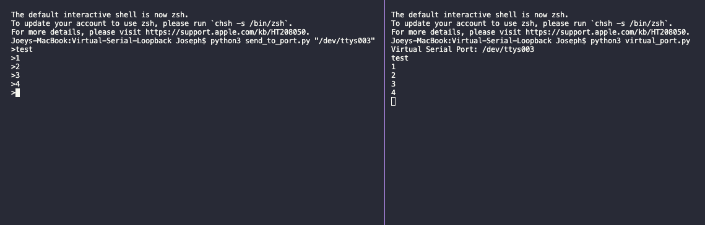

# Virtual Serial Port

Tool that creates a virtual serial port that echos messages to the terminal

## Usage

```python3 virtual_port.py``` Virtual port creator

```python3 send_to_port.py $port_name``` Test terminal

